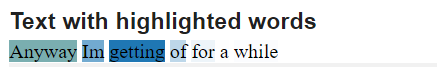
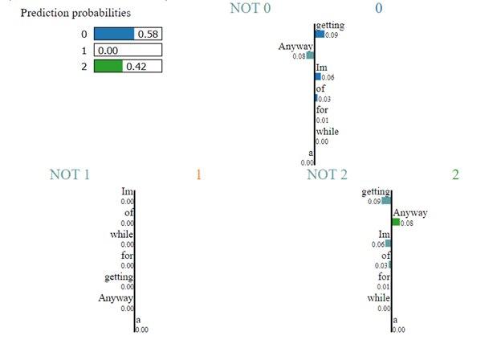

# IFT6390_Kaggle_Competition_2

# Overview
- We are provided with over 1 million texts which are annotated as negative, positive and neutral. The task
is to create features based on the provided data and use machine learning algorithms to classify them.
- We used different strategies to build the features, such as n-gram (bag of words, bi-gram, tri-gram),
TF-IDF and word embedding(word2vec). Similarly, we also tried different models to implement classifiers
such as Naive Bayes, Support Vector Machines, and Neural Networks (NN and RNN). In terms of results,
the best score for Kaggle using the method SVM is 0.82391

# contents
- Readme.md                   // help
- dataset  // dataset from the kaggle <--need additional download   
- NaiveBayes.ipynb            // Naive Bayes using Bag of words and TF-IDF features
    - naivebayes.py
- SVM.ipynb                   // Kernelized SVM
    - svm.py
- NNandRNN.ipynb              // NN and RNN using Bag of words features
    - nn.py
- TextCNN.ipynb               // TextCNN using word2vec features
    - DataPrepare.ipynb       // Preprocessing for TextCNN
    - TrainW2V.ipynb          // Train word2vec
    - textcnn.py              
    - trainw2v.py
- nb-with-explainability.ipynb      //  explainability of Naive Bayes
    - nb-with-explainability.py

# How to run
step1:
Download the dataset from the kaggle website and put the folder in the correct location as shown in the directory
    Text Classification Challenge:
    https://www.kaggle.com/t/6c98b08e131d49abaa8915175de22ced

step2:
Configure the right environment, for example: Colab (which I use)
Note: The pytorch version is 1.13.0

step3:
To reproduce the project, run the following notebooks follow the annotations:
- `NaiveBayes.ipynb`
- `SVM.ipynb` 
- `NNandRNN.ipynb` 
- `nb-with-explainability` 
To reproduce the TextCNN, run the following notebooks in the given order and follow the annotations: 
- `DataPrepare.ipynb` 
- `TrainW2V.ipynb`
- `TextCNN.ipynb`

# Introduction {#sec:intro}

We are provided with over 1 million texts which are annotated as
negative, positive and neutral. The task is to create features based on
the provided data and use machine learning algorithms to classify them.

We used different strategies to build the features, such as n-gram (bag
of words, bi-gram, tri-gram), TF-IDF and word embedding(word2vec).
Similarly, we also tried different models to implement classifiers such
as Naive Bayes, Support Vector Machines, and Neural Networks (NN and
RNN). In terms of results, the best score for Kaggle using the method
SVM is 0.82391.

# Feature Design {#sec:dates}

**Select datas:** In train.csv and test.csv downloaded from Kaggle, The
dataset has more than 100,000 texts in total. we only need to delete the
last column to get the required feature. In train_result.csv, we need to
replace sentiment labels with numbers: negative = 0, neutral = 1,
positive = 2. Then, we explore the distribution of the data, we noticed
that the number of texts in the neutral label is much smaller than the
other two. Assuming that the data distribution in the test set is the
same as the data set, the correct prediction of the neutral text has
very little impact on the overall accuracy. We will not apply data
augmentation for now.

{width="0.5\\linewidth"} []{#fig:ex
label="fig:ex"}

\
**Text Pre-processing:** Unlike image data, text data is often very
non-standard and difficult to directly use for model training. text data
contains noise in various forms like emotions, punctuation, text in a
different case. In our case, we will use NLTK(Natural language toolkit)
and spacy to help us do preprocess.

-   **Expand contractions:** Contractions are short forms of words, such
    as don't for not and aren't for not. We need to extend this
    contraction in text data for better analysis.

-   **Lower Case:** We make all the text in the same case for better
    analysis.

-   **Remove punctuations:** One of the other text processing techniques
    is removing punctuation. They often do not affect the meaning of the
    text.

-   **Remove words containing digits:** We need to remove the words and
    digits which are combined like IFT6390 or IFT6758. Which creates a
    problem for machines to understand.

-   **Remove Stopwords:** Stopwords are the most commonly occurring
    words in a text which do not provide any valuable information.
    stopwords like they, there, this, where, etc. NLTK library is a
    common library that is used to remove stopwords and includes
    approximately 180 stopwords which it removes. If we want to add any
    new word to a set of words then it is easy using the add method.

    However, in text sentiment analysis, some stop words may express
    emotions. For example, 'not like' is a negative emotional phrase,
    but if not is removed, it becomes a positive emotion. Therefore,
    whether to remove stop words in sentiment analysis is debatable.

-   **Stemming and Lemmatization:** Lemmatization is a systematic way to
    reduce the words into their lemma by matching them with a language
    dictionary. This helps reduce the dimensionality of the data.

-   **Remove Extra Spaces:** We remove potentially redundant spaces from
    the text.

We can compare the original text with the preprocessed text, which is
much shorter:\
*'Why does twitter eat my DM's? Not happy' VS\
'why twitter eat dm not happy'.*\

# Algorithms

-   **Bag of words (BOW):** is represented as the bag (multiset) of its
    words, disregarding grammar and even word order but keeping
    multiplicity. The first step in creating a BOW Model is to create a
    dictionary of all the words used in the corpus. At this stage, we
    will completely ignore grammar and only the occurrence of the words
    is captured. The dictionary will contain all unique words across the
    corpus. And each word in the dictionary will be treated as a
    feature. for example:\
    Sentence 1: \"The cat sat on the hat\"\
    Sentence 2: \"The dog ate the cat and the hat"\
    Vocab = the, cat, sat, on, hat, dog, ate, and \
    Sentence 1: { 2, 1, 1, 1, 1, 0, 0, 0 }\
    Sentence 2 : { 3, 1, 0, 0, 1, 1, 1, 1}\
    Then we will convert each text to a vector representing the
    document's available words. Each text will be converted into a
    vector with the length of the dictionary, and after converting all
    the text into a vector, we will have a sparse matrix.\
    The advantage of the bag of words method is that it is fast and
    simple. However, the BOW is a very high-dimensional and sparse
    matrix. And the model is orderless and can not capture the semantics
    or morphology of the text.

-   **Term Frequency -- Inverse Document Frequency(TF-IDF):** Compared
    with the bag of words method that simply converts text into count
    vectors, TF-IDF converts words into weighted vectors. Prior
    knowledge shows that the importance of a word is directly
    proportional to the number of times it occurs in a document, but
    also inversely proportional to the number of times it occurs in all
    documents. TF-IDF for word I in the documents is given by:
    $$TF(w) = \frac{number\ of\ times\ the\ term\ w\ appears\ in\ the\ document}{total\ number\ of\ terms\ w\ in\ the\ document} = \frac{count(w)}{totalW}$$
    $$IDF(w) = ln\frac{number\ of\ the\ documents\ in\ the\ corpus}{number\ of\ documents\ in\ the\ corpus\ contain\ the\ term} = \frac{totalD}{count(d,w)}$$
    $$TF-IDF(w) = TF(w)\times IDF(w)$$ The advantage of the TF-IDF
    method is that it has some basic metrics to extract the most
    descriptive terms in a document. But because it is Based on the
    bag-of-words (BoW) model, therefore it does not capture the position
    in the text, semantics, co-occurrences in different documents, etc.
    TF-IDF is only useful as a lexical-level feature.

-   **N-Gram :**An N-Gram is a sequence of N-words in a sentence. For
    example, if we put N=1, then it is referred to as a uni-gram. If you
    put N=2, then it is a bi-gram. If we substitute N=3, then it is a
    tri-gram. Compared with the bag-of-words method, n-gram includes the
    context of words, so it can preserve the order of documents to a
    certain extent. For bigram: Sentence 1: \"The cat sat on the hat\"\
    Sentence 2: \"The dog ate the cat and the hat"\
    Vocab = the cat, cat sat, sat on, on the, the hat, the dog, dog ate,
    ate the, cat and, and the\
    Sentence 1: { 1, 1, 1, 1, 1, 0, 0, 0, 0, 0}\
    Sentence 2 : { 1, 0, 0, 0, 0, 1, 1, 1, 1, 1}\

-   **word2vec :** Word2Vector is a popular embedding algorithm, it
    extracts word embeddings from a shallow neural network that is used
    to perform a surrogate task, similar to a kind of auto-encoder,
    where we do not care about its predicted output, but only extract
    its learned parameters as the word embeddings we need.

-   **Naive Bayes classifier :** In machine learning, naive Bayes
    classifiers are a family of simple probabilistic classifiers based
    on applying Bayes' theorem with strong (naive) independence
    assumptions between the features.
    $$P(class/features) = \frac{P(class) * P(features/class)}{P(features)}$$
    $$\propto P(features/class) = \prod \limits_{i} P(feature_i/class)$$
    Multinomial Naive Bayes is very popular in natural language
    analysis, it is suitable for task classification with discrete
    features (e.g., word counts for text classification). In our case,
    We used BOW features and TF-IDF features, and we can call the
    sklearn library to use it very simply.

-   **Kernelized SVM :** Support vector machine is a supervised model
    which computes the decision boundary that separates the most the
    support vectors (vectors that are nearest to the decision boundary)
    from the boundary by maximizing the smallest geometric margin, where
    vectors are representations of data points. Kernelized SVM, which
    operates on vectors mapped to a specific feature space through the
    kernel, was used to make this sentiment analysis.

-   **Neural Nets :** The neural network is similar to the signal
    transmission of biological neurons, and the neurons in the hidden
    layer pass information to each other to obtain a more effective
    nonlinear model. We started with a simple neural network using only
    one hidden layer, details are covered in the next section.

-   **Recurrent neural network :** RNN (recurrent neural network) is a
    type of artificial neural network commonly used in speech
    recognition and natural language processing. Recurrent neural
    networks recognize data's sequential characteristics and use
    patterns to predict the next likely scenario.

-   **Convolutional Neural Network :** CNN (Convolutional Neural
    Networks) can also handle text classification problems.
    Convolutional neural networks are generally used to process image
    data, from the beginning of the basic convolutional layer, to the
    later addition of pooling, BN, dropout, padding and other layers,
    the network becomes more sophisticated. Convolutional neural
    networks have superior feature extraction and classification
    capabilities. Therefore, we can try to treat text as a
    one-dimensional image and use CNN to classify the text.

# Methodology

-   **training/validation split:** Use 30% of the data set as the
    validation set. This is a commonly used method when there is a large
    amount of data. When the total number of data is small, we can
    choose k-fold cross-validation to increase the robustness of the
    model.

-   **Count Vectorizer:** We implement BOW by calling sklearn's
    CountVectorizer, whose output is a sparse matrix. In order to reduce
    the computational complexity (dimension of the sparse matrix), we
    can choose two hyperparameters:\
    Max Features: The count vectoriser converts each token into a
    predictive feature, which may be in the thousands or even millions
    for text data. Max Features is a parameter that will limit how many
    of them you can use as predictors. We set it to 1000.\
    min_df: We noticed that some words are very rare and do not contain
    any meaning, we set min_df = 5 to filter them out.

-   **word2vec:** In the training of the shallow neural network in
    Word2Vec, we mainly adjusted two hyperparameters, window and
    min_count, where window represents how many words are considered for
    each word's contextual relationship, and we found that 3 is
    appropriate; min_count represents the minimum times of occurrence of
    the generated embedded words, this parameter controls the size of
    the embedded word list, which has a great impact on the goodness of
    the embedding vector, after many experiments and careful
    consideration, we finally chose 30 as its value.\
    Finally, we obtain a table of embedding vectors in size
    (449913, 100) where each column represents an embedding vector of
    one word, and each vector has 100 dimensions, much smaller than BoW
    vectors. To get the embedding of a sentence, we simply average the
    embedding vectors of all words. We mainly employ Word2Vec word
    vector embedding in TextCNN.

    **Method**

-   **Kernelized SVM:** Different texts from the data set are firstly
    converted to vectors through CountVectorizer before being learned by
    SVM. The grid search was performed to find near-optimal
    hyper-parameters which increased the accuracy by around 2%.
    Initially, a non-linear kernel such as a Radial basis function (RBF)
    kernel was tested using "sklearn.svm.SVC(kernel='rbf')" and found
    impractical considering the number of samples (over 1 million, the
    kernel size would be a pain for computation), and reduction of a
    number of samples seems to be a bad idea since more data means lower
    variance, thus more solid result. Therefore, a linear kernel was
    finally used to handle a large number of samples
    (sklearn.svm.LinearSVC, which is equal to SVC with " kernel='linear'
    ").

-   **Simple neural network:** The model is composed of the
    nn.EmbeddingBag layer plus a linear layer for the classification
    purpose. Since nn.EmbeddingBag accumulates the average across the
    embeddings on the fly, nn.EmbeddingBag can enhance the performance
    and memory efficiency to process a sequence of tensors. We did not
    add additional optimization to it, the model is only used to verify
    the feasibility of the neural network.

-   **Recurrent neural network:** We use torch.nn.RNN to quickly build
    an RNN network based on the previous model.

-   **Convolutional Neural Network:** Training/Validation Split: Here we
    divide the training set and the validation set in the ratio of
    roughly 9:1. That is, with the total number of 1,040,323 entries,
    900,000 of them are used as the training set and 140,323 as the
    validation set. Optimization Tricks:\
    1. Dropout: During the forward propagation in the training phase of
    the model, the activation values of some neurons are allowed to quit
    working with a certain probability (0.5 here), which can eliminate
    the dependency between neurons and make the model more
    generalizable.\
    2. Update Embeddings during training: help to adjust some improper
    embedding vector values, which may slow down the training but can
    improve the valid accuracy by 0.5 to 2 percent. Setting
    Hyper-parameters: Here we mainly discuss the network architecture
    design of TextCNN, whose key architecture is three convolutional
    layers along with three max-over-time pooling layers. We set up 64
    convolutional kernels in each of the three convolutional layers, as
    the most common setup for text sentiment analysis tasks is 64
    convolutional kernels per layer. Yet we designed different
    convolutional kernel sizes for the three convolutional layers, the
    conv kernel sizes of the three layers are 3, 4, and 5 respectively,
    designed to extract contextual mutual information features at
    different scales. The initial convolutional layer extracts only very
    localized textual association information, and the deeper the
    convolutional layer, the more macroscopic the scale of information
    extracted. Such a design is somewhat similar to the Inception module
    in GoogLeNet, i.e., feature aggregation at different scales, which
    can ensure that we can extract text association features more
    completely at different scales.

# Results

-   **Best score:** The Best model is SVM with the test accuracy of
    0.82391, and its training time (including hyperparameters tunning)
    would be within 1 hour, which is relatively fast considering the 1
    million samples data set, thanks to the linear kernel.

    The table below shows the accuracy obtained by all methods tried:

    ::: center
                **Method**              **Text model**     **Test Accuracy**
      ------------------------------ -------------------- -------------------
          Naive Bayes classifier             Bow                 0.749
          Naive Bayes classifier            TF-IDF               0.748
             *Kernelized SVM*         *Bow(grid search)*        *0.824*
          Simple neural network              Bow                 0.786
         Recurrent neural network            Bow                 0.783
       Convolutional Neural Network        word2vec              0.821
    :::

-   **Naive Bayes classifier:** When the Naive Bayesian classifier uses
    the bag-of-words feature, the accuracy of the test set is 0.749, and
    in the case of TF-IDF the accuracy of the test set is 0.748, which
    is similar to Bow.

-   **NN and RNN with Bow:** When using bag-of-words features, the final
    correct rates of the simple neural network and the recurrent neural
    network on the test set are: 0.786 and 0.783.

-   **TextCNN with word2vec:** The Naive Bayes classification technique
    is simple but powerful We use Word2Vec word vector embedding in
    TextCNN, choose a learning rate of 1e-3 and a batch size of 64, and
    train for 5 epochs. We can observe that the accuracy on the training
    set keeps increasing and finally reaches about 90%, while the
    accuracy on the validation set starts decreasing after reaching a
    peak of 82.11% on the third epoch, thus we can say the model starts
    to overfit the train data from the third epoch, we should stop here.
    So the best performance for TextCNN on the validation set is 0.403
    as loss and 0.821 as accuracy.

# Discussion

-   **Naive Bayes classifier:** classification task in machine learning.
    When used for textual data analysis, such as Natural Language
    Processing, the Naive Bayes classification yields good results.

    We trained bag-of-words features and TF-IDF using this method and
    achieved similar performance. This is due to short text with less
    than 20 words, most of the words in the sentence appear only once so
    that TF (Term Frequency) won't play any role since the frequency
    will almost always be 1.

    For optimization, we may use the n-gram approach instead to get more
    context information.

-   **Kernelized SVM:** The non-linear kernel could be revisited with
    the proper undersampling method to reduce the sample size of the
    data set, which, although would increase variance and reduce the
    stability of the learning model, may have a better performance with
    non-linear decision boundary.

-   **NN and RNN with Bow:** We noticed that in the case of using the
    bag-of-words model, whether it is using a simple neural network or a
    more complex recurrent neural network, the accuracy of the test set
    of the model is limited. This may be because the bag-of-words method
    cannot capture the semantics or morphology of the text, so it
    contains less information and cannot correctly represent the text.
    We can choose more complex word embedding methods such as word2vec
    or GloVe, which can include more text information.

-   **TextCNN with word2vec:** Pros: Used the more sophisticated
    Word2Vec embedding algorithm compared to BoW; employed 1D
    convolutional kernels of different sizes to extract contextual
    features at different scales; Introduced dropout layer and training
    weight update to enhance generalization; Achieved high prediction
    accuracy among all methods.

    Cons: Long training time of the model; overfitting training set
    still exists; may not using the optimal hyperparameter set.

    Ideas for improvement: Include more measures to prevent overfitting,
    such as BN layer, regularization, etc.; Explore better
    hyperparameter combinations and model structures via Grid Search &
    Neural Architecture Search (NAS).

-   **Explainability-Naive Bayes classifier:** This model's results can
    be interpreted with help of Local Interpretable Model-Agnostic LIME
    explanations. With 0 being negative, 1 being neutral and 2 being
    positive, we can see how each word is contributing toward the final
    prediction as examples below. Of course, this naive Bayes model is
    still far from perfect, but it does recognize some positive patterns
    such as the words "prefer" or "anyway" which could give a positive
    sentiment in most cases.
    
   
    
    
    
    

# Statement of Contributions

-   **Haoyue Sheng:** Naive Bayes classifier, Simple neural nets,
    Recurrent neural network and rapport

-   **Yichong Li:** Kernelized SVM, Explainability in Naive Bayes
    classifier and rapport

-   **Luirui Ma:** TextCNN with word2vec and rapport

